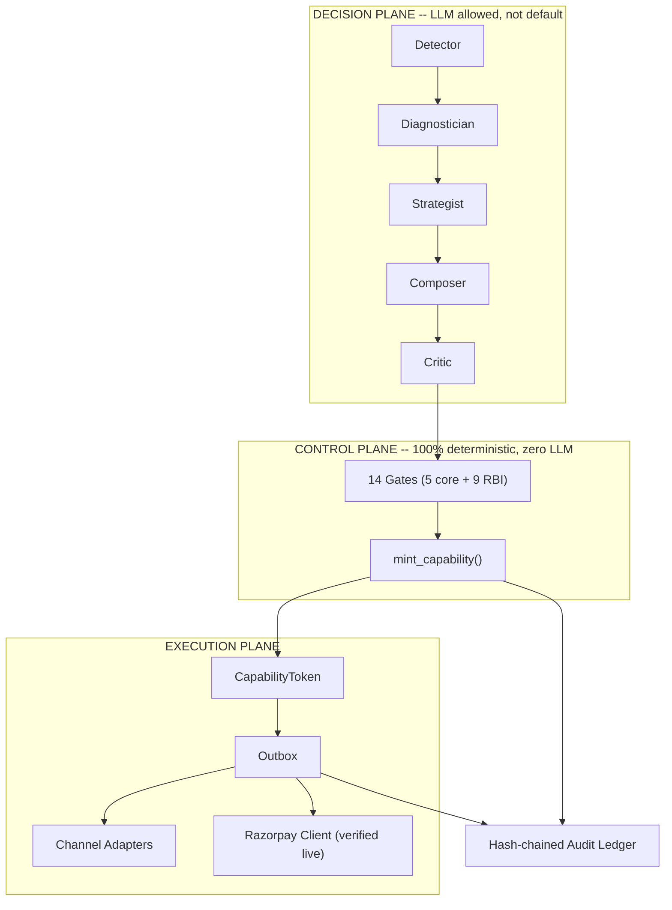
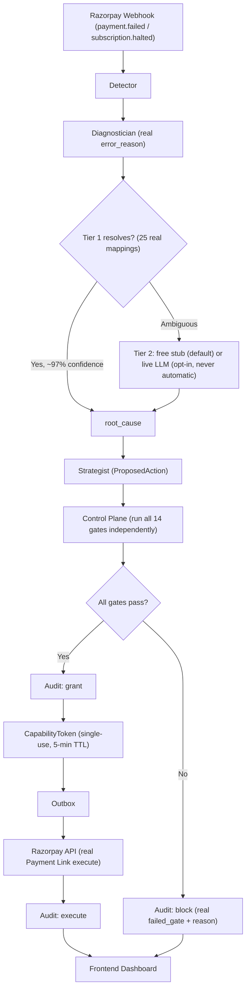
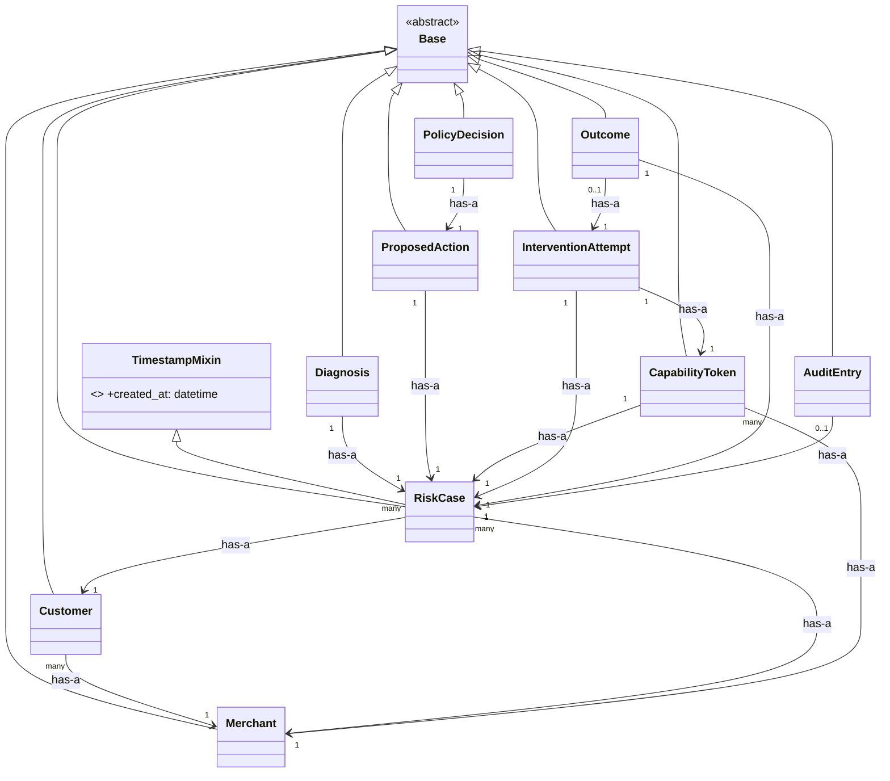

# Bakaya

An AI-driven revenue recovery system for Razorpay's AI Buildathon 2026,
Track 03. Detects payment failures, checkout abandonment, and mandate
lapses; diagnoses the likely cause; decides whether and how to intervene
through a deterministic, independently-auditable control plane; and
executes the intervention through real channel adapters.

Built for Razorpay's actual documented API surface, not a generic payments
system: the root-cause taxonomy is keyed on Razorpay's real `error_reason`
field, the compliance gates implement RBI's e-mandate/pre-debit-notification
requirements, and the execution client (`app/execution/razorpay_client.py`)
has been verified against live Razorpay test-mode infrastructure.

## Read this first if you're evaluating this project

Three documents, in this order:

1. **This file** -- what the system is, how to run it, how to verify any
   claim yourself.
2. **`EVALUATION.md`** -- every measured number in this project, with the
   exact command to reproduce each one, and an explicit table of what's
   real versus simulated. Read this before trusting any specific figure.
3. **`HONEST_LIMITATIONS.md`** -- 15 specific, current limitations, stated
   directly rather than left for you to discover. If something below
   sounds too clean, check there first.

Every claim in this README that has a number attached is backed by a real,
runnable command. None are estimated or aspirational. Where something is
simulated rather than measured against real customer behavior, that is
stated at the point the claim is made, not buried in a footnote.

## What's real versus simulated (short version)

See `EVALUATION.md`'s full table for the complete breakdown. The load-bearing
summary: **every control-plane gate, every audit entry, and Tier-1 diagnosis
are real, deterministic, and verified against live infrastructure where
applicable** (Razorpay test-mode API, a live Groq LLM comparison). The one
place synthetic data remains load-bearing is *recovery outcomes* -- whether
an intervention actually gets money back -- because that requires a live
merchant with real transaction volume, which this project does not have.
Every recovery-lift number in `EVALUATION.md` is reported with that caveat
attached explicitly, every time.

## Diagrams (for a fast skim)

Three real diagrams, generated from the actual codebase, not aspirational.
GitHub renders these directly -- no image files needed.

### 1. System architecture -- the three planes

Rendered top-to-bottom, not left-to-right, so it stays readable in a narrow
column instead of shrinking to fit full width.



The one rule everything else depends on: **the Decision plane's output is
never trusted by the Control plane.** Every proposal is independently
re-derived against ground truth before anything real happens. See
`ARCHITECTURE.md` for the full breakdown of every gate and agent.

### 2. System design -- real request flow, one case

Same reasoning as above -- a sequence diagram with 8 side-by-side lanes
shrinks badly in a narrow column, so this is a top-to-bottom flowchart with
explicit decision points instead. Same real logic as `ARCHITECTURE.md`.



### 3. Class diagram -- real ORM models, `is-a` / `has-a`

Every model in `app/models/` inherits from `Base` (SQLAlchemy's declarative
base, `is-a`) and mixes in `TimestampMixin` for `created_at` -- shown once
in full below, then abbreviated for the rest to stay scannable. No cascade
deletes are configured anywhere in this schema, so every relationship below
is a real foreign key (`has-a`), not a claimed ownership/lifecycle bond.
10 of the real 18 models are shown -- `Consent`, `Suppression`, `CostEntry`,
`Experiment`, `ContactBudgetLedger`, `ModelVersion`, `InboundEvent`, and
`FailureEvent` are omitted here for scannability, not hidden (see
`app/models/*.py` for all 18).



## Architecture, in one paragraph

Three planes, strictly separated. The **Decision plane** (Detector ->
Diagnostician -> Strategist -> Composer -> Critic) is the only place an LLM
is ever consulted, and even there, the default path
(`app/agents/diagnostician.py::TEACHER_STUB`) is a free, deterministic
keyword classifier -- the live LLM option exists and is verified working
(`EVALUATION.md` section 2) but is never invoked automatically. The
**Control plane** (`app/control_plane/`) is 100% deterministic: 14 gates
(5 core + 9 RBI-derived) independently re-derive whether a proposed action
is authorized, never trusting what the Decision plane claims. A capability
token is minted only if every gate passes, is single-use, case-scoped, and
carries a 5-minute TTL. The **Execution plane** (`app/execution/`,
`app/webhooks/`) sends through real channel adapters and records the result
in a hash-chained, append-only audit ledger (`app/models/audit.py`) --
every grant and every block is audited, not just successes.

## Project layout

```
app/
  agents/         Detector, Diagnostician (2-tier), Strategist, Composer, Critic
  api/            FastAPI server backing the live dashboard (app/api/server.py)
  control_plane/  The 14 gates + capability-token minting (capability.py)
  detectors/      6 detector surfaces (payment_failure, checkout_abandonment, etc.)
  execution/      Razorpay client (verified live), channel adapters, outbox
  experiment/     Arm assignment, oracle-ceiling calculation
  ladder/         Ladder-level routing (L0-L6), random-policy ablation arm
  mlops/          Drift detection, shadow evaluation, rollback
  models/         18 SQLAlchemy tables
  observability/  Structured logging, tracing, metrics
  schemas/        Pydantic contracts (RiskCaseIn, DiagnosisOut, etc.)
  security/       Spotlighting, instruction hierarchy, red-team suite
  sim/            Deterministic synthetic population + response model
  webhooks/       Razorpay webhook handler (HMAC verification)
frontend/         React + Vite dashboard, reads real data via app/api/server.py
scripts/          Batch runner, ablation, calibration, seeding, live smoke tests
tests/            351 tests
```

## Quick verification (5 minutes, no setup beyond Python)

```
git clone <this repo>
cd bakaya-core
python -m venv venv && venv\Scripts\activate    # or source venv/bin/activate on Linux/macOS
pip install -r requirements.txt
python -m pytest tests/ -q
```

Expect **351 passed**, zero failures, zero network calls, zero API keys
required. This is deliberate: everything that can be verified without live
credentials is designed to be verified without live credentials.

## Running the live dashboard

```
python scripts/seed_db.py --n 200 --seed 20260901 --fresh
$env:DATABASE_URL = "sqlite:///./bakaya.db"          # PowerShell
uvicorn app.api.server:app --reload --port 8000
```

In a second terminal:

```
cd frontend
npm install
npm run dev
```

Open `http://localhost:5173`. Every number on the dashboard is read live
from the SQLite database the seed script just populated -- not mock data.
Clicking into a case shows a real, gate-verified evidence chain, including
a real SHA-256 hash from the audit ledger for any ALLOW or BLOCK decision.

## Reproducing the evaluation numbers

Every command below is free and requires no API key:

```
python -m pytest tests/ -q                          # 351 tests
python run_batch.py --n 1000 --seed 20260901         # headline batch result
python scripts/ablation_arms.py --n 1000 --seed 20260901   # 4-arm ablation + oracle ceiling
python scripts/calibration_report.py                 # confidence calibration bands
python scripts/stability_sweep.py --n 300 --seeds 20 # stability across seeds
python scripts/mutate_gates.py                       # mutation testing (14 gates)
python -m pytest tests/test_redteam.py -v             # 15-attack red-team suite
python -m pytest tests/test_adversarial_policy.py -v  # 24 proposals, 5 scenarios
```

Two commands require live credentials and are optional -- see
`EVALUATION.md` section 3 for what each one verified:

```
python scripts/compare_llm_diagnosis.py     # requires GROQ_API_KEY, ~7.5 min, real cost (fractions of a cent)
python scripts/smoke_test_razorpay.py       # requires RAZORPAY_KEY_ID/SECRET (test mode), free
```

## Headline numbers (see EVALUATION.md for full context on every one)

- **351 tests passing**, zero flaky, zero requiring live credentials
- **64.0% diagnosis accuracy** (deterministic stub, free path) -- **94.0%**
  with the live LLM path enabled (not the default; EVALUATION.md section 2)
- **14/14 control-plane gates** independently confirmed to actually block
  when disabled (mutation testing, EVALUATION.md section 4.1)
- **0 of 15 red-team attacks succeeded**; 0 of 24 adversarial-policy attacks
  succeeded (EVALUATION.md sections 4.2-4.3)
- **9 real bugs found and fixed** during evaluation itself, documented in
  full in EVALUATION.md section 5 -- including two genuine surprises found
  only by making live API calls to Razorpay

None of these numbers claim to predict what a real merchant would see.
They demonstrate that the architecture, routing logic, and safety gates
behave correctly against a population and a taxonomy whose ground truth is
known, because it was either generated deterministically or sourced
directly from Razorpay's own documentation.

## Status of the documentation set

All complete:

- `README.md` -- this file
- `EVALUATION.md` -- every measured number, with reproduction commands
- `HONEST_LIMITATIONS.md` -- 15 specific, current limitations
- `ARCHITECTURE.md` -- the three-plane design, every gate, every agent,
  verified against real code and real test names
- `COMPLIANCE.md` -- all 9 RBI-derived gates, their real thresholds, and
  the honest distinction between "tested and blocking" versus
  "circular clause independently verified"
- `SECURITY.md` -- the 15-attack red-team suite and the 24-proposal,
  5-scenario adversarial-policy suite, both with real, current results
- `RUNBOOK.md` -- operational procedures, grounded in real failure modes
  this project's own development actually hit
- `SCALE.md` -- what's real (indexes, the outbox pattern) versus what
  has not been measured (throughput, latency, load) -- stated directly
  rather than implied
